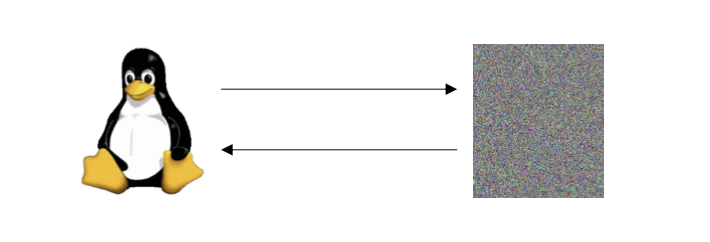
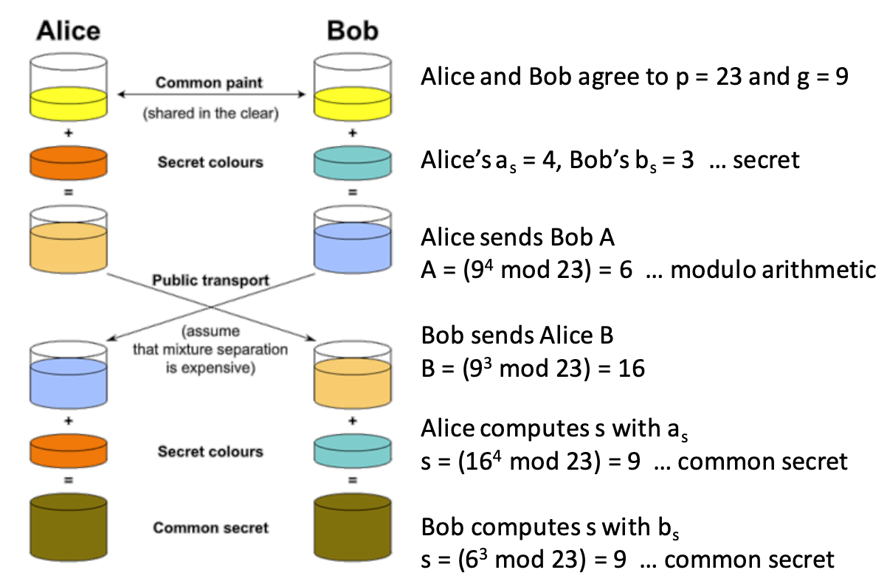
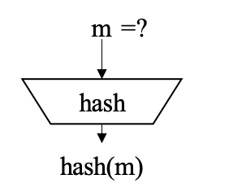

# Basic Cryptography

## Classic Cryptography

### 용어정리

**Encryption**: 메세지의 의미를 숨기도록 메세지를 변환하는 과정

**Decryption**: 암호화된 메세지를 본래 형태로 복원하는 과정    

**Cryptosystem**: A system that describes how to encrypt or decrypt messages

**Plaintext**: Message in its original form

**Ciphertext**: Message in its encrypted form

**Cryptographer(암호학자)**: encryption algorithms 을 발명하는 역할

**Cryptanalyst(암호분석가)**: encryption algorithms or implementations 을 파훼하는 역할

- **Security Benefits of Cryptography**
    
    confidentiality(기밀성) : 메세지 내용을 원치 않는 사람(공격자)으로부터 숨김
    
    integrity(무결성) : 메세지가 공격자에 의해 수정되지 않고 내용 그대로 전달됨을 보장
    
    authenticity(유효성): 소통하는 당사자가 적절한 당사자가 맞는 지
    
    Non-repudiation: 누군가가 해당 메세지의 유효성을 부인할 수 없도록 함 

### **Cryptosystem**

M: set of plaintexts

K: set of keys

C: set of ciphertexts

E: set of encryption functions e: M x K → C

D: set of decryption functions d: C x K → M

1. **Substitution ciphers (치환 암호)**
    
    암호화와 복호화에 동일 키 사용 → 송신자와 수신자는 같은 Key를 공유한다. (혹은 동일한 방법으로 파생되는)

    plaintext → ciphertext (일정학 규칙에 따라 한 글자를 다른 글자로 1:1 치환)
    
    ex. ceasar cipher
    
    (ceasar cipher에서 key가 3일때) HELLO WORLD → KHOOR ZRUOG
    
    공격방법이 밝혀져 있기 때문에 현재는 잘 사용되지 않는다
    
    - **Caesar Cipher**
        
        [카이사르 암호](https://ko.wikipedia.org/wiki/카이사르_암호)

        M = { sequences of letters }
        
        K = { i | i is an integer and 0 ≤ i ≤ 25 }
        
        E = { Ek | k **∈** K and for all letters m, Ek(m) = (m + k) mod 26 }
        
        D = { Dk | k **∈** K and for all letters c, Dk(c) = (26 + c – k) mod 26 }
        
        C = M
        
        - **Attacking**
            
            **Exhaustive search** : 가능한 모든 key 시도해보기 (key space가 0~25까지 매우 작기 때문에) = brute force
            
            **Statistical analysis**: 영어의 1-gram model과의 상관관계 비교
            
            평문과 암호문은 모두 영어 알파벳의 영역에 있음
            
            brute force의 최적화된 버전
            
            긴 Cyphertext여도 암호문의 일부만 해석하면 적은비용으로 Key를 알아낼 수 있음
            
            
            
            암호문에 있는 각 글자의 빈도수를 계산
            
            
            
            일반 영어의 통계적 빈도
            
            p(x) : english 알파벳 내에서 x의 빈도
            
            f(c) : ciphertext 내에서 c의 빈도
            
            Θ(*i*) = Σ(0 ≤ *c* ≤ 25) *f*(*c*)*p*(*c* – *i*)
            
            
            
            상관관계 높은 순서부터 후보군
            
        - **Problem**
            
            Key space가 너무 작다 → key를 더 길게 만들어야 함 
            
            통계적 frequencies를 잘 숨길 수 없음 → 새로운 아이디어 고안
            
            2 gram model 사용 → 두 글자를 한 토큰으로 → key에 여러 문자를 사용하면 2 gram model에서 각각의 정수 두개로 치환할 수 있음 → 통계적 frequencies가 잘 나타나지 않음
            
            exhaustive search 를 더 오래걸리게 하는 방안\
            
    - **Vigenère Cipher**
        
        [비제네르 사이퍼(Vigenère cipher)  사용법과 그 해독법](https://kevin0960.tistory.com/entry/비제네르-사이퍼Vigenère-cipher-사용법과-그-해독법)
        
        
        
        **Period:** key의 길이
        
        **polyalphabetic:** key에 어떤 letter이 올 수 있는지 규칙
        
        Vigenère Cipher = polyalphabetic cipher **(다중치환암호)**
        
        단일치환암호와는 다르게 평문의 하나의 알파벳이 1:1로 대응되지 않고 여러 알파벳에 대응되지 않기 때문에 단순히 전체 암호문의 빈도를 조사하는 것으로는 아무런 정보를 얻을 수 있다는 특성이 있다.
        
        Caesar cipher 과 비슷하지만 phrase를 단위로 사용한다
        
        3글자 key를 사용 → plaintext의 길이에 맞게 키를 반복
        
        period까지 맞춰야 하므로 Frequency Analysis가 잘 통하지 않는다
        
        - Attack
            
            
            
            1. plain text를 n개의 부분으로 나눈다 (예시에서는 N=5)
            2. period 설정
                - **Kasiski Test**: ciphertext 내 글자의 반복이 이루어지는 기간을 추산(바깥 그림에서는 OPKW…. OPKW 이므로 9) → 9의 배수 혹은 9의 약수가 Period의 후보
                    
                    
                    
                    10개중 7개가 2를, 10개중 6개가 3을 factor로 갖고 있으므로 Period = 6 으로 시작이 가능하다
                    
                - **Index of coincidence (IC) - 동시발생 지수 (프리드만 기법):** 암호문에서 무작위로 선택한 두 글자가 같을 확률
                    
                    [[암호개론] 프리드만의 동시발생지수(Index of coincidence)](https://blog.naver.com/username1103/222098044975)
                    
                    문자가 균등하게 분포하고 문자열이 길어질수록 0.038에 가까워진다
                    
                    일반적인 영어 텍스트의 경우 문자열이 길어질수록 0.066에 가까워진다.
                    
                    
                    
                    period별로 미리 계산된 값
                    
                    
                    
                    n은 ciphertext의 길이 Fi는 암호문에서 문자 i가 나타나는 횟수 (빈도수)
                    
                    해당 ciphertext에서  IC = 0.043 →  key가 5보다 크다고 추정 가능함 ⇒ 6으로 결정
                    
            3. 시저 암호의 방식과 동일하게 각 알파벳에 대하여 판단
                
                
                
                period를 6개로 나누기로 결정하였으니 1번째줄은 각 1번째글자, 7번째글자, 13번째 글자… 를 뜻함 (2번째 줄은 2번째, 8번째 , 14번째 …)
                
                IC가 높을수록 문자 분포가 균등하지 않고 특정 문자가 편향되어 나타남 → 일반 영어 텍스트와 비슷한 특성 (E, A가 다른문자들보다 더 자주 등장)
                
                동시발생 지수가 0.067보다 크면 암호문이 단일 대치 암호가 아니라 다항식 암호일 가능성이 높다고 판단
                
                즉 해당 암호는 일반 영어 평문을 암호화 했을 가능성이 있다.
                
                1. 1단계
                    
                    
                    
                    좌측 6개의 문장은 위의 6개의 문장과 동일
                    
                    각 문장에서 나타나는 알파벳의 빈도수를 나타냄
                    
                    1번째 줄과 영어 평문의 빈도수를 비교해 보면 비슷한 것을 알 수 있음. → 6개의 순환 규칙 중 1번째는 unshifted 라고 추측할 수 있다.
                    
                    3번째 줄의 경우 I 를 A로 shift 했을 때 영어 평문의 빈도수와 비슷해짐 → 6개의 순환 규칙 중 3번째는 평문을 +8만큼 shift 한 것으로 추측할 수 있다. → 암호문에서 -8만큼 shift
                    
                    6번째 줄의 경우 V를 A로 shift 했을 때 영어 평문의 빈도수와 비슷해짐 → 6개의 순환 규칙 중 6번째는 평문을 -5만큼 shift 한 것으로 추측할 수 있다. → 암호문에서 +5만큼 shift
                    
                2. 2단계
                    
                    
                    
                    제일 우측 맨아래 **A**J**E** 주목
                    
                    **A**J**E** → ARE로 추측 가능 → 6개의 순환 규칙 중 2번째는 A → S 즉 평문을 -8만큼 shite 한 것으로 추측할 수 있다. → 암호문에서 +8만큼 shift
                    
                3. 3단계
                    
                    
                    
                    맨 마지막의 **MICA**X 주목
                    
                    맨 마지막 line에 MICAX 는 형용사의 마지막 접미사 “~mical” 으로 추측할 수 있다. → 6개의 순환 규칙 중 4번째는 A → O 즉 평문을 +14만큼 shite 한 것으로 추측할 수 있다. → 암호문에서 -14만큼 shift
                    
                4. 4단계
                    
                    
                    
                    마지막 5번째 순환규칙은 brute force로 해결 (26가지 경우의 수 밖에 없으니까)
                    
                5. 최종
                    
                    
                    
                    Q다음에는 항상 U가 옴 → I ⇒ U 즉 평문을 +12만큼 shift함 → 암호문에서 -12만큼 shift 함으로써 마지막 5번째 순환주기의 암호를 맞춤
                    
                    비제네르 사이퍼를 해독하는 과정에 무수히 많은 guess가 동원되므로 예술의 영역이라고 불리운다.
                    
    
2. **Transposition ciphers (전치 암호화)**
    
    
    
    블록(4글자) 단위로 나누어서 전치가 이루어짐.
    
    plaintext 내의 letter들을 재배열 → ciphertext
    
    정상적인 평문 배열을 특정한 키의 순서에 따라 평문 배열을 재조정하여 ***암호화***하는 방법
    
    영어 평문과 1-gram frequencies 는 같지만 n-gram frequencies는 다르다
    
    해당 예시에서 brute force 시 key size에 따라 {key_size-1}! (팩토리얼)의 가능성이 있음
    
    현재까지도 널리 사용되는 방법

## **Symmetric Cryptography (대칭 키 암호화)**

    Block cipher: 한번에 고정된 크기의 블록 암호화
    
    길이 고정 메세지를 처리할 때 편리
    
    ex. DES/AES
    
    Stream cipher: 한번에 각 숫자(일반적으로 각 비트)를 암호화
    
    가변적인 메세지를 처리할 때 유연성이 더 좋다
    
    평문과 동일한 크기의 **pseudo random key stream** 사용
    
    일반 텍스트의 길이만큼 길기 때문에 **key stream 이라고 함**
    
    비디오 스트리밍에 유리함
    
    CBC 모드 암호화와 달리 암호화가 병렬화 가능

---

- **Statistical Cryptanalysis를 방지하기 위한 전략**
    1. **Diffusion**
        
        평문 - 암호문 사이의 통계적 상관관계를 모호하게 만들기
        
        평문에서의 단일 비트의 변화는 암호문에서 다수의 비트에 영향을 끼친다(다수에 비트에 확산된다 = diffusion)
        
        고주파 영역의 정보가 저주파 영역으로 확산되어야 함 (균일하게)
        
    2. **Confusion**
        
        키와 암호문 사이의 통계적 상관관계를 숨기기
        
        암호문의 각 bit는 key의 여러 부분에 의존해야 함 → key에서의 단일 비트의 변화는 암호문의 대부분 모든 비트에 영향을 끼친다.
        

## Block cipher

- **Data Encryption Standard (DES)**
    
    
    
    2000년대 전에 사용됨
    
    64 bit data block size
    
    56 bit key size (or 56+8 parity bits)
    
    튜닝된 **Feistel Cipher** 의 일종

    Key size는 고전암호보다는 크지만 컴퓨터의 연산 성능 발전에 비해 너무 작다 (1998년도에도 이틀만에 깰 수 있음)
    
    - **Feistel Cipher**
        
        
        encryption scheme를 building 하기 위한 일종의 프레임워크
        
        DES는 페스탈 암호의 한 형태
        
        Input 값 F를 임의로 정할 수 있음
        
        F를 몇개의 라운드에 거쳐 정의할 수 있으며, 각 단계에서 어떤 Key를 제공해야 하는지에 대한 key scheduling 방법또한 제공된다.
        
        암호화 작업과 복호화 작업은 매우 유사한 과정을 거친다.
        
        차이점: key index가 다르고 key가 reversed 된다.
        
        초기 56비트의 키에 의해 모든 키스케쥴링 된 키를 유도할 수 있다. 
        
        

            
- **Advanced Encryption Standard (AES)**
    
    128-bit (16 bytes) block size
    
    128-, 192-, or 256-bit key size
    
    국가기밀을 다루는 데에 사용된 알고리즘
    
    Feistel Cipher이 아님
    
    복호화는 암호화의 역순
    
    - substitution permutation network (SP network)
        
        
        
        16 bytes의 4x4 column-major grid 사용
        
        10라운드(128bit), 12라운드(192bit), 14라운드(256bit) 중 하나를 수행 (Key 크기에 따라 다르다)
        
        각 라운드 내에서 substitution permutation operation 수행 → 추가된 키가 암호문 전체에 영향을 미침 → 복호화는 암호화의 역순
        
        하드웨어는 보안통신을 할 때 마다 AES 암호화 및 복호화를 빈번하게 수행 → 모든 주요 CPU 가속화 지원
        
        개방형 SSL 또는 암호 라이브러리에서 널리 사용됨
        
        1. **SubBytes (substitution)**
            
            
            
            원래 메세지가 9a라면 90 → 0a 라인으로 이동한다면 substitution의 결과를 얻을 수 있음 → 통계적 공격에 저항할 수 있도록 비선형성을 추가
            
            역계산이 가능하다
            
        2. **ShiftRows (permutation)**
            
            각 row를 시프트 → 통계적 공격에 저항할 수 있도록 비선형성을 추가 → permutation (diffusion)
            
        3. **MixColumns (permutation)**
            
            행렬곱으로 각 열을 섞음 → permutation (diffusion)
            
        4. **round key addition**
            
            subkey와 XOR연산이 실행됨
            
            subkey(라운드 키)를 추가함으로써 원래 키가아닌 라운드가 진행됨에 따라 얻은 값을 지속적으로 반영한다. diffusion + confusion
            
- **Handling Multiple Blocks**
    
    Basic algorithm은 블록 단위로만 암호화 할 수 있다.
    
    평문의 크기가 블록 크기보다모자랄 경우 → 특정 규칙으로 원본 메세지를 패딩
    
    평문의 크기가 블록 크기보다 클 경우 → 여러개의 block을 핸들링
    
    여러개의 작동 모드가 있음
    
    - **Electronic Code Book (ECB)**
        
        
        
        평문을 여러개의 블록으로 나눈다
        
        각 블록별로 암호화가 진행됨
        
        모든 블록에 대해 **동일한 키**를 사용하여 암호화
        
        각 블록마다 나온 결괏값을 연결 (Electronic Code Book)
        
        
        
        ECB과정을 이미지로 표현 / 각 과정에서 블록마다 동일한 키를 사용 하기 때문에 매우 유사한 암호문이 발생할 수 있음 
        
        결국 암호화 된 결과물이 일종의 Original과의 상관관계를 가지고 있다.
        
    - **Cipher Block Chaining (CBC)**
        
        
        
        원래의 블록을 대칭 암호 알고리즘에서 필요한 크기로  분할 한 다음 추가적인 chain을 설치
        
        처음에는 key **⊕** 첫 block → 첫 블록의 암호문
        
        이전블록의 암호문 **⊕** 블록의 평문 → 해당 블록의 암호문
        
        같은 내용의 Input이라도 다른 내용의 Output이 나올 수 있음 (EBC의 단점 보완)
        
        **여러 블록의 암호화를 병렬화 할 수 없음** → 직렬화 된 구조때문에 GPU 병렬연산을 활용하지 못한다는 trade-off
        
        **여러 블록의 복호화는 병렬화 할 수 있음** (이전 블록의 결과를 요구하지 않으므로)
        
    - **Counter Mode (CTR)**
        
        
        
        Nonce: 각 과정에서 한번만 사용되는 숫자 / **counter** (Nonce + Key): Encrypt 부분
        
        Block cipher → Stream cipher
        
        CBC보다 더 안전하다.
        
        Nonce 값을 보는 것 만으로는 암호화된 Nonce 값을 만들 수단이 없기 때문
        
        공격자가 key를 가지고 있지 않기 때문에 Nonce 값을 암호화 하지 않는다.
        
        CBC는 암호화 시 병렬화가 불가능하지만 Stream cipher와 비슷한 방식을 채택하여 병렬 암호화가 가능 (각 블록 계산시에 종속성이 없음)
        
        각 과정에 Nonce가 추가됨으로써 stream cipher에서 일회용 random key와 동일한 역할을 함
        
    - **Galois Counter Mode (GCM)**
        
        
        
        트래픽은 AES GCM을 통해 암호화 되어있다고 가정할 수 있음
        
        authenticated encryption → **Confidentiality** + **Origin Authentication (Integrity)** 보장
        
        암호문이 진짜 출처에서 나왔는지 확인할 수 있다 (prevent chosen-ciphertext attacks)
        
        유효한 태그를 새로 생성하는 것은 불가능
        
        High throughput
        
        대칭 암호 시나리오에서는 동일한 송,수신자에게 동일한 키에 대한 접근권한이 있어야 암호 해독이 가능하다.
        
        실제 secret key의 소유자 = 송신자
        
        chosen-cyphertext attacks 방지 (암호 태그를 해독 시 공격자가 Key를 알 수 있는 방법이 없어서 tag를 생성할 수 없음)
        
        HTTPS 프로토콜도 지원
        
- **A random initialization vector (IV)**
    
    
    
    **counter = Nonce = initialization vector**
    
    단 한번만 생성됨(재사용 불가), 무작위성이 보장되어야 함
    
    pseudo random number generator를 사용하여 나온 난수가 Nonce, IV로 사용됨
    
    Encryption : secret key + IV + message
    
    또한 IV(암호화 되지 않은)는 일반적으로 암호화된 메세지 바로 옆에 일반 텍스트로 첨부됨
    
    - **Trust Dies in Darkness (Shedding Light on Samsung’s TrustZone Keymaster Design)**
        
        
        
        안드로이드 키 마스터: 보안 키 저장 서비스 (모든 키 관리 권한이 일임됨)
        
        키 마스터가 키를 저장 및 자신을 위해 키를 생성, 애플리케이션을 대신하여 저장된 키를 사용한 암호화, 어플리케이션 대신 키 배포 및 저장 등등의 역할을 함
        
        키마스터 API는 사용자가 IV를 설정하지 않고 대신 항상 랜덤한 12바이트 IV를 생성하도록 허용해야 한다.
        
        
        
        보통 안드로이드 키마스터는 하드웨어(칩-삼성) 공급업체가 아닌 OS 개발사(구글)에서 하는 것.
        
        삼성은 키마스터를 하드웨어(디스크) 단계에서 TrustZone에 구현함 → IV를 공격자가 제어할 수 있다(공격자는 디스크 내의 모든 데이터에 액세스 할 수 있음)
        
        B는 공격자 소유의 앱, A는 공격하려는 대상 앱
        
        
        
        공격자는 동일한 IV를 사용하도록 강제하여 A앱이 가진 Key를 계산할 수 있음
        
        공격자는 Key B (plain text) 와 Binary B (ciphertext)를 가지고 있으며, Binary A (ciphertext)를 알고있기 때문에 해당 계산식을 통해 Key A를 도출해 낼 수 있다.
        
        삼성은 IV를 사용자가 임의로 설정할 수 있게 개방하였음 (모든것의 원흉) - 키마스터 TA가 제공하는 API를 통해 노멀 월드가 IV의 값을 설정할 수 있기 때문
        

### Non-Malleability

MAC tag : 메세지와 비밀키를 모두 사용하여 서명하는 절차의 결과

모든 암호화 체계가 충족해야 하는 중요한 속성

**malleable**: 중간에서 plaintext에 predictable change를 가하는 경우 암호문을 수정할 수 있음

공격자가 능동적으로 메세지를 도청하는 경우

1. 통신 채널을 적극적으로 방해하는 공격자
2. 송신자를 사칭하여 채널에 통신에는 injection을 시도하는공격자

One-time pad는 약간 malleable하다.

Secrecy 와 integrity 는 수직적인 문제 (Trade-off)

안전한 커뮤니케이션을 위해서는 integrity 또한 중요하다.

CRC는 intentional malicious errors를 탐지하도록 설계되지 않았음

**MAC (message authentication code)** : 비밀키 + 메세지 를 활용해서 메세지에 하는 일종의 서명

무결성을 제공하기 위함

수신자 측에서 MAC tag 검증 후에 일치하지 않는다면 메세지를 거부할 수 있음 (중간에 메세지에 변조가 들어갔다고 추측 가능)

## Asymmetric Cryptography (대칭 암호화)

### Asymmetric Cryptosystems

목표: secret key를 공유하지 않고 암호화 하는 방법

일종의 디지털 서명

Public-key Cryptography (공개 키 암호화 라고도 불림)

각 주체는 2개의 Key pair를 가지고 있다

공개키 (Public Key) P

모두에게 공개되어 있음

비밀키 (Secret Key) S

공개된 P에 대해 S를 찾기가 공학적으로 불가능 함

- Alice가 bob에게 message M을 보내려고 할 때
    
    Alice: Pb(M) → C
    
    Alice ⇒ C ⇒ bob
    
    Bob: Sb(C) → M
    
    Eve 가 C를 보더라도 해독할 수 없음 (소유자만 비밀 키를 알고있다는 가정 하에)
    
    M = K (secret key) 일 때, 즉 symmetric key 를 안전하게 전송할 수 있음
    
- Non-repudiation 검증
    
    M과 C를 모두 bob에게 보내고 integrity를 검증할 수 있다.
    
    Alice: Sa(M) → C
    
    Alice ⇒ M and C ⇒ Bob
    
    Bob: Pa(C) → M’ ⇒ M과 비교
    

대칭 키 암호화보다 속도가 훨씬 느리다

비대칭 암호화를 사용하여 공유 키를 교환 한 다음 대칭 암호화로 전환하는 방식 주로 사용

하드웨어 가속은 비대칭 암호화에서도 동작 하도록 설계되지 않았음

- **Diffie Hellman key exchange**
    
    
    
    공개된 네트워크에서 키를 안전하게 교환할 수 있는 방법
    
    교환 과정에서 Public transport를 사용하기 때문에 공격자는 해당 데이터에 접근할 수 있다고 가정
    
    최종 결과로 common secret을 만들어 낼 수 있음
    
    Moduler 연산으로 공격자의 역연산을 방지할 수 있음 → 이진 로그 문제 (g, p, a, b를 잘 선택하면 역연산이 불가능하게 만들 수 있다.)
    
    substitution, permutation보다 느리다.
    
    공개된 값 
    
    g^a mod p
    
    g^b mod p
    
    g and p (보통 엄청 큰 값을 부른다 → 느림)
    
    비공개 값
    
    a and b
    
    - Ex. attacker side
        
        
        
        퍼블릭 키 교환 과정
        
        g^m 값으로 자신만의 퍼블릭 키를 만듬
        
        g → 퍼블릭 키 가 일반적으로 알려진 값이기 때문에 중간에서 이를 가로채 자신의 퍼블릭 키를 전달할 수 있다.
        
        수신자는 실제 송신자로부터 public key가 왔는지 실제로 구별 할 방법이 없다.
        
        해결방법: 디지털 인증서, **public key infrastructure (PKI)**
        
    
- **RSA (Rivest-Shamir-Adleman)**
    
    [RSA 암호](https://ko.wikipedia.org/wiki/RSA_암호)
    
    비대칭 암호화 알고리즘
    
    소인수과 큰 소수에 의존 (엄청 큰 숫자는 소인수 분해하기 어렵다)
    
    1. 두개의 소수를 고른다. 31과 37
    2. 31 * 37 = 1147
    3. 1147 의 Factor은 무엇인지 소인수 분해 하는게 곱셈보다 쉬울까?
    - **RSA Key Generation**
        
        모든 소수 p와 모든 정수 a에 대해 **a^p = a mod p** 가 성립함
        → x^(ed) = x mod pq, if ed = 1 (mod (p −1)(q −1))
        
        1. 두개의 매우 큰 소수 P와 q를 고른다
        2. N = p * q 계산
            
            N을 소인수 분해하기는 어렵다
            
            임의의 a(0<a<N), N, e(e>1)에 대해 c = a^e mod N 을 계산하기는 쉽다.
            
            주어진 c, e, N 에 대해 a를 추정하기는 어렵다.
            
        3. T = (p-1)  * (q-1) 계산 → **Euler Totient**
        4. (e * d) mod T = 1인 e를 선택
            
            4-1. e는 소수이며, T의 인수가 아님
            
            4-2. extended Euclidean algorithm으로 d를 선택
            
        5. Public key = (e, N)
        6. Secret key = (d, N)
        - Ex. Key Generation
            
            
            
        - Ex. Encryption
            
            
            
        - Ex. Decryption
            
            
            
        - Ex. RSA Encryption & Decryption
            
            
            
        
        지수는 곱셈보다 느리고 곱셈 또한 CPU 연산이 느림 → 일반 메세지를 암호화, 복호화 하는 데에 사용되지 않으며 서명 및 인증 기능을 주로 수행한다
        
        share secret을 주고받는 데에 사용 가능하지만 middle attack의 대상이 될 수 있다.
        

## Hybrid (Asymmetric + Symmetric) Cryptosystem

대부분 통신은 대칭 암호화를 사용 (효율성)

비대칭 암호화는 비용이 많이 들기 때문에 단일 세션에서만 유지되고 통신 당사자간의 인증에 주로 쓰인다. 

Long-term (static) key: Identy에 바인딩 됨

신원 인증 방법으로 주로 RSA가 쓰임

디지털 서명

계속 쓰임

Short-term (ephemeral) keys: 세션에 바인딩됨

Diffie Hellman 을 사용하여 해당 세션에만 유효한 shared secret key를 도출

shared secret key를 이용해 대칭 암호화로 세션을 암호화한다.

상대적으로 매우 짧은 시간동안만 쓰임

**Forward Secrecy**: 세션 키 교환에 사용된 long-term secret(내 Identity에 바인딩 된 RSA key)이 손상되더라도 세션 키는 손상되지 않음 → 과거 세션 키의 보안에 영향을 미치지 않는다.

기록 상의 암호화된 통신을 나중에 해독할 수 있는 방법이 없음

Long-term / Short-term key를 구분하여 각 세션에 대해새로운 세션 키를 생성하는 아이디어 (장기적으로 저장 X)

→ Key exchange에 RSA가 사용되지 않는 이유

Diffie Hellman이 더 빠름 (효율적)

### Cryptographic Hash Functions

임의의 크기의 데이터를 고정된 크기의 string으로 변환한다. (효율적)

태그와 디지털 서명의 크기는 작아야 함

- ex.
    
    정보 유출의 방지를 위해 salt와 함께 사용
    
    타임스탬핑 (누가 더 일찍 비밀을 발견했는 지 증명)
    
    메세지 인증 코드
    
    디지털 서명
    
- **Requirements for Cryptographic Hash Functions**
    
    **One-wayness (단방향성)**: 
    
    계산하기 쉽고 속도가 빠르다
    
    hash(m) = h 인 h에 대해 m값을 역계산은 할 수 없음
    
    → 손실 압축
    
    
    
    **Collision resistance (충돌 저항성)**: 해시 함수가 안전한것으로 자격을 갖추기 위해서 가장 중요한 속성
    
    **Second pre-image resistance (Weak collision resistance)**
    
    주어진 Input m1에 대해 hash(m1) = hash(m2)인 m2를 찾기가 힘들다
    
    m1만 주어짐
    
    
    
    **Collision resistance (Strong collision resistance)**
    
    임의의 두 메세지 m1, m2를 선정했을 때 hash(m1) = hash(m2) 일 확률이 극히 낮다.
    
    m1, m2 둘다 주어짐
    
    
    
    정보를 숨기는 기능을 하지 않음 (dictionary table attack)
    
    Key와 같은 의존성이 없다.
    
    - **Hash Collision Attack Scenario**
        
        비대칭 암호화로 pdf파일을 하는데 오랜 시간이 걸림 → 1차 해시를 생성해서 보안을 유지
        
        이브는동일한 해시값을 가지는 1.pdf와 2.pdf를 만들었다.
        
        앨리스는 1.pdf에 대하여 서명했다.
        
        이브는 1.pdf에 대한 사인을 2.pdf에 첨부했다. (attack)
        

### **Building Crypt Hash Functions**

[SHA1 / SHA2 알고리즘](https://m.blog.naver.com/vjhh0712v/221453210356)

- **Merkle-Damgård Construction**
    
    
    
    메세지를 고정된 크기의 블록으로 나눈다 (padding 포함)
    
    압축함수 f(체인 변수 (IV로부터 시작해서), 메세지 블록) ⇒ 다음 체인 변수
    
    - MD5 (Message digest algorithm)
        
        안전하지 않음
        
        collision attack이 많이 보고되었다
        
        pre-image attacks이 이론적으로 가능하다
        
        보안적인 목적으로 사용되지 않는다.
        
        의도치 않은 corruption으로부터(예를들어 라우터를 거치면서 데이터 손실) 데이터 무결성을 검증하는 데에 사용 (체크섬)
        
    - Secure Hashing Algorithms(SHA-Family)
        
        인텔은 하드웨어에 sha 작업을 포함할 수 있게 x86 아키텍처를 확장함 (그만큼 빈번한 작업)
        
        - SHA-1
            
            1995년에 NSA에 의해 발명됨
            
            output: 160bit
            
            block size: 512bit (한번에 512bits을 처리)
            
            sha-1 충돌
            
        - SHA-2
            
            NSA에 의해 발명됨
            
            SHA-256 outputs 32 bytes
            
            SHA-512 outputs 64 bytes
            

### Digital Signatures

[디지털 서명](https://ko.wikipedia.org/wiki/디지털_서명)

네트워크에서 송신자의 신원을 증명하는 방법

실제 서명 X

해당 작업을 가속화 하는데에 해시가 사용

충돌 X, 보안문제 X, 메세지 경량화, 속도 향상

- Ex.
    
    앨리스는 어떤 메세지 M의 송신자가 자신임을 모두에게 증명하고 싶어한다.
    
    S는 시크릿키 암호화, P는 퍼블릭키 복호화
    
    Alice: Sa(hash(M)) -> SigM 과 M ⇒ bob
    
    Bob: hash(M) =? Pa(SigM) (**signature verification**)
    
    Eve가 M을 M’으로 변조한다면?
    
    Bob: hash(M’) =? PA(SigM) → hash(M’) ≠ hash(M) (해시 함수가 암호학적으로 안전하다는 가정 하에)
    

### Message Authentication Codes (MAC)

[해싱(Hashing)을 활용한 HMAC(Hash based Message Authentication Code)](https://m.blog.naver.com/techtrip/221723355441)

[Hash Length extension attack - 길이 확장 공격](https://eine.tistory.com/entry/Hash-Length-extension-attack-길이-확장-공격)

통신 시 양 당사자 간에 공유된 단일 비밀키 하나가 있다고 가정 (대칭 키 암호화)

목표: 메세지의 **Authenticity**, **integrity** 검증

암호화된 메세지에 MAC를 첨부 → 수신자는 MAC를 검증하는 과정

공격자가 임의의 메세지에 대해 신자가 생성한 MAC을 계산할 수 없어야 한다.

- Hash-based MAC (HMAC)
    - **H ( message )**
        
        안전하지 않음(해시에는 보안 기능이 없기 때문에)
        
        Secret-independent - 공격자는 메세지와 해시 값을 모두 변경할 수 있다.
        
        모두가 해당 MAC 값을 계산할 수 있음
        
        one-time pad를 사용해서 암호화된 메세지는 무결성 공격에 취약하다 (신뢰하기 어려움)
        
        plain text에 예측가능한 변화를 줄 수 있음
        
    - **H ( key || message )**
        
        해시 함수에 key 종속성 추가
        
        H가 Merkle-Damgård construction 구조를 사용하는 해시 함수라면 length extension attack이 가능하다
        
        
        
        뒤에 메세지 블록을 덧붙여서 추가 연쇄작용 발생 가능
        
        공격자는 메세지 끝에 다른 메세지를 연결할 수 있음 → 생성된 해시값을 사용하여 전체 메세지에 대한 최종 해시 값을 계산할 수 있음
        
        공격자는 Key값을 모르고 메세지, 메세지 해싱 값 만으로도 원하는 메세지를 injection 가능하다.
        
        메세지를 완전 대체하는 것은 불가능
        
    - **Hash-based MAC (HMAC)**
        
        
        
        opad, ipad는 상수, 서로 다른 값
        
        HMAC는 MAC이 요구하는 것보다 더 강력한 보안 보장을 제공
        
        HMAC는 key의 의존된 메시지에 대한 정보를 표시하지 않음
        
        공격자는 key를 모르면 해시를 다시 생성할 수 없음 → length extension attack이 불가능 (내부해시, 외부해시가 따로 있어서)
        
        해싱 → 메세지 확장 기능 제거
        
    - HMAC vs. Digital Signatures
        
        
        **HMAC**
        
        데이터 무결성 검증에 초점을 둠
        
        공격자가 Shared secret key에 대한 접근을 할 수 없게 해야 함
        
        송, 수신자가 동일한 secret key로 검증 과정을 거침
        
        **Digital Signatures**
        
        송신자 검증에 초점을 둠
        
        송신자의 secret key에 대한 접근을 할 수 없게 해야 함
        
        송신자는 secret key, 수신자는 Public Key를 사용하여 검증 과정을 거침
        

---

### Public-Key Infrastructure (PKI)

[Out-of-Band 데이터 통신](https://www.joinc.co.kr/w/Site/Network_Programing/Documents/Out_Of_Band)

[Out Of Band (OOB data)](https://blog.naver.com/sanghun0318/220399680353)

공개키를 신뢰할 수 있는 방법은?

**MitM attack** : 공격자가 중간 전달과정에서 공개키를 자신의 것으로 대체할 수 있다.

Diffie-Hellman 이전의 공격방식

송신자: M → sender Pub key 암호화 → C

공격자: C → sender Sec key 복호화 → M / M’ → receiver Pub key 암호화 → C’

수신자: C’ → receiver Sec key 복호화 → M’

**키 배포를 위해서 Certificate Authority (CA)의 서명을 binding**

1. Delegate/Centralization 방식
    
    **Public-Key Infrastructure** (Roots of trust)
    
2. Decentralization 방식
    
    Web of trust (X)
    
- **Public-Key Infrastructure (PKI)**
    
    **Digital Certificates (디지털 인증서)**: ID와 Pub key 간의 binding
    
    Certificate Authority (CA)에 의해 서명 및 발급됨 → binding을 서명하는데 사용된 개인 키는 CA가 소유
    
    Pub key의 실제 소유권자인지 인증하는 역할 (공개 키의 구속력, 소유권을 증명)
    
    해당 인증서에 해당하는 비밀키가 유출 될 겅우 CA가 인증서를 취소함
    
    Expired, Revoked 되었는지 확인하는 과정을 거침
    
    **Certificate Authorities (CAs)**: Identity 확인 및 Certificates**를** 발급하는 기관
    
    여러개의 인증 기관이 있고 CA간의 계층 구조가 있음 → 다른 CAs의 바인딩에 서명하는 방식으로 신뢰할 수 있는 다른 CAs에게 위임할 수 있음
    
    최상위 인증 기관 뿐만 아니라 여러 local CA가 있다.
    
    **out of the band** 에서 인증 발생
    
    Https(TLS/SSL)가 PKI를 사용
    
    Root CAs: local CAs를 신뢰하지 않더라도 Root CAs는 신뢰할 수 있어야 한다.
    
    다음 단계의 인증기관에게 해당 인증기관이 신뢰할 만한지 타고 가다보면 최종적으로 Root CAs는 신뢰할 수 있어야한다.
    
    OS 혹은 소프트웨어로 배포됨 (windows에서 certmgr)
    
    운영체제를 열면 신뢰할 수 있는 모든 인증기관을 확인할 수 있음
    
- **Digital Certificate Creation**
    
    
    
    대역 외의 인증기관이 신원을 확인 → 검증 → 신원 파일에 인증기관의 디지털 서명이 추가됨
    
    은행 사용시 공동인증서가 필요
    
    스마트폰 인증 시 인증 기관이 인증서를 발급하고 SNS메세지를 통해 스마트폰 소유자가 본인임을 확인 → 해당 인증서를 통해 out of band 인증과정을 거치지 않고 사용 가능
    
    
    
    인증서를 확인했다 → 해당 서버에 대한 엑세스가 어떤식으로든 납치되지 않았다는 것을 의미
    
    웹 서버 인증 시에 HTTPS 프로토콜 사용 ⇒ TLS사용 ⇒ PKI를 사용한다는 것을 의미
    
- **Authenticated Key Exchange**
    
    
    
    **Ephemeral key**: 세션을 연결할 때마다 Diffie Hellman 과정에 의해 생성되는 임시 키
    
    1. User → Web server : 유저의 임시 공개키 쌍 중 하나 전달
    2. 웹 서버는 자신의 long-term 비밀키로 자신의 임시 공개키에 서명
    3. Web server → user : CA에 의해 발급된 인증서 + 웹서버의 임시 공개키 + Web server long-term Secret key로 암호화(서명)한 웹서버의 임시 공개키
    4. User가 전달받은 임시 키의 진위여부 확인
        1. 암호화된 웹서버의 임시 공개키를 서버의 long-term 공개키로 복호화하여 전달받은 임시 키와 비교
        2. 전달받은 인증서가 어떤 인증기관에서 서명되었는 지, 인증서가 일치하는 지 등등 검증
    5. 각각 전달받은 임시키 쌍으로 Shared Secret 생성
    6. AED와 같은 대량 암호화 통신 수행

    
- **bad usecase of hybrid (asymmetric and symmetric) cryptography**
    
    
    
    랜섬웨어에 대칭키 암호화 방식만 사용 될 경우 키를 reverse engineering 할 수 있음 → 하이브리드 암호화 (대칭키 + 비대칭키)
    
    **Wannacrypt**: 랜섬웨어, 멀웨어 툴
    
    모든 파일을 암호화하는 데에 몇시간 넘게 걸림 (랜섬웨어에는 속도가 중요하다)
    
    1. **서버 공개키**만 저장 
    2. **클라이언트별 개인/공개키** 쌍을 생성 
    3. **서버 공개키**로 **클라이언트 개인 키**를 암호화 후 **개인 키** 원본을 버림(**dump**) 
        
        → **원본 개인키**는 **서버 개인키**로만 확인 가능
        
    4. 감염시킬 모든 파일에 대해 **공개/개인키** 쌍 생성
    5. **클라이언트 별 공개키**를 사용하여 **파일별 대칭 키 쌍**을 암호화 후 원본을 버림(**dump**)
        
        → 해당 시점에서 파일을 암호화 하는 데에 사용된 **대칭 키**를 복구 가능한데, 파일별로 **대칭키**를 생성 후 바로 버리기 때문에 중간에 알아채더라도 복구 할 방법이 없다.
        
    
    감염된 파일을 복호화 할 수 있는 **개인키**는 **클라이언트별 개인키**로 복호화 해서 얻을 수 있으며, **클라이언트별 개인키**는 **서버 개인키**로 복호화 해서 얻을 수 있다.
    
- **good use of asymmetric cryptography: Verified Boot**
    
    
    
    안드로이드 스마트폰 부트체인
    
    안드로이드 부팅 시 구글이 서명한 이미지를 실행한다. (스마트폰 내의 구글의 공개 키가 내장되어있음)
    
    - **Verified Boot 가 모든 코드를 신뢰할 수 있는 소스(개인키 보유자)의 것임을 검증하는 과정**
        1. CPU가 read-only 저장소에서 1단계 부트로더(BL1)의 전원을 켜고 로드
        2. BL1은 저장소에서 BL2를 찾아 메모리에 로드
        3. ROTPK(Root of Trust Public Key)를 사용하여 메모리상의 BL2의 무결성을 검증
            
            구글의 공개 키 사용
            
        4. 무결성 확인 시 BL2는 secure / non-secure worlds 를 분리하고 최대 3개의 3단계 부트로더(BL3)를 메모리에 로드
        5. BL3-3 은 non-secure OS kernel을 로드